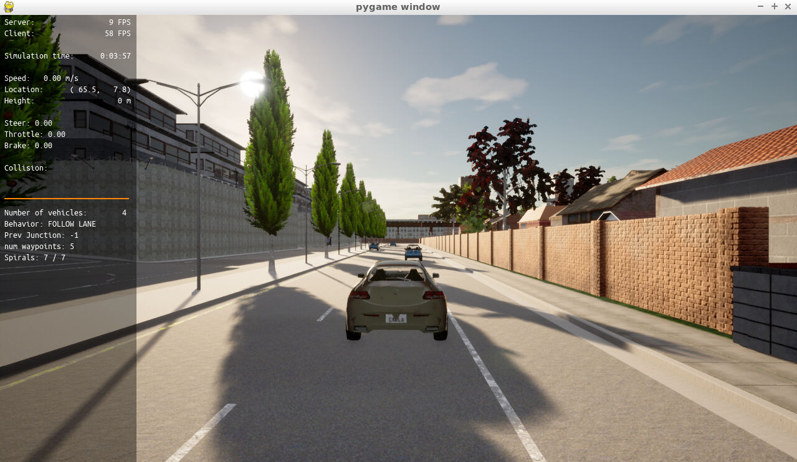
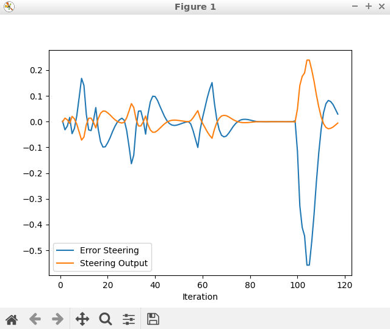
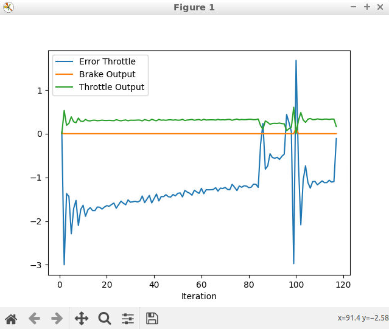

## Writeup

### Add the plots to your report and explain them (describe what you see) 

The steering plot shows how the steering output attempts to offset the steering error by acting in the opposite direction to the error in a proportional manner.In the simulationscenario it appears as though there are several places where
there is what appear to be a large bias introduced to the steering, but the I gain term quickly is able to start compensating for this offset.

The throttle plot shows how the throttle attempts to offset the error. The most striking thing about this plot is the oscillations as the vehicle attempted to get to its target speed. It was difficult to accomplish this in a way where the taget speed was still achieved in a reasonable amount of time.
The eventual parameters chosen are not perfect, but got the vehicle to move without running into anything or driving off the road.

### What is the effect of the PID according to the plots, how each part of the PID affects the control command?
* P - The P (proportional) term affects the control command as a direct offset to the error between the systems current motion and the desired motion. This is often the most heavily weighted, and so in the plots one can see how the control command is directly proportional to the offset.
* I - The I (integral) term is there to account for constant offsets or errors in the system. The longer that the error persists, the more the I term will dominate and thus the system will start to correct more and more strongly to account for the constant offset. In the steering plot, this is shown
as the slope of the output generally increases as the steering error persists.
* D - The D (differential) term helps keep the P term in check. On its own the P term will overshoot and oscillate, so the D term attempts to dampen this oscillation.

### How would you design a way to automatically tune the PID parameters?
As discussed in the course, automatic tuning can be done algorithmically with the Twiddle algorithm. FOr this controller, since there are actually two, I would start with optimization of the throttle PID in a simualtion environment where no steering is needed. 
Then, I would introduce some steering factors to algorithmically tune the steering PID. After both algorithms, I would visually inspect the results to be sure that everything looks smooth and not uncomfortable.

### PID controller is a model free controller, i.e. it does not use a model of the car. Could you explain the pros and cons of this type of controller?
* Pros: Model free controllers are easy to apply to any model of vehicle and there for very easy to reason about in a general sense.
* Cons: It is very difficult to fully optimize these controllers, as certain specifications of a system have different capabilities such as accelration/top speed/steering control.

